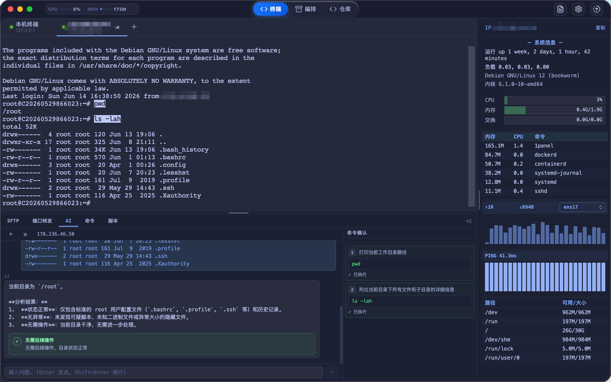

# OpsBatch

[简体中文](README_CN.md) | [English](README_EN.md)



OpsBatch 是一个面向运维场景的本地桌面工作台，基于 **Tauri v2 + React 19 + TypeScript + Rust** 构建，核心数据持久化在本机 SQLite 数据库中。
无需部署中心服务，即可在本地统一管理服务器资产、SSH 终端、RDP/VNC 远程桌面、批量命令、脚本库、文件传输、自动化工作流与运维知识同步。

## ✨ 功能特性

### 资产与连接管理

- **主机资产管理**：主机名称、IP、端口、认证方式、操作系统、分组、标签、跳板机链路等。
- **分组与选择**：嵌套分组、资产搜索、主机选择，并基于所选主机发起终端/命令/传输操作。
- **导入导出**：主机 CSV 导入导出。
- **云主机导入**：支持阿里云、AWS、腾讯云实例拉取与导入。
- **SSH 配置 / 跳板机**：解析 `~/.ssh/config` 中的主机与 `ProxyJump`，自动构建跳板链路。

### 终端、监控与远程文件

- **终端工作区**：本地终端与远程 SSH 终端标签页。
- **主机监控**：连接后查看 CPU、内存、磁盘、网络、进程等快照（主要面向 Linux/procfs）。
- **SFTP 文件面板**：本地/远程双栏浏览、上传、下载、预览、重命名、删除、新建目录、书签、解压与传输队列。
- **远程编辑器**：从 SFTP 面板打开远程文件/目录，使用 CodeMirror 编辑并通过 SFTP 保存。
- **端口转发**：终端底部面板提供端口转发入口。

### 远程桌面

- **RDP 连接**：独立窗口连接 Windows 主机，支持域、桌面分辨率、剪贴板、音频、磁盘映射；H.264 直显与 bitmap 两种呈现路径。
- **VNC 连接**：基于 noVNC 与本地 WebSocket bridge 连接，支持端口、用户名、密码、共享连接与只读模式。
- **调试与日志**：RDP/VNC 页面输出连接、帧率、传输与诊断日志，便于排查问题。

### 批量执行与文件分发

- **批量命令执行**：对选中主机并发执行，支持并发数、超时、实时结果、失败重试与历史记录（连接信号量限制单次并发为 4）。
- **危险命令防护**：内置与自定义危险命令规则，执行前确认，可结合 AI 风险说明；正则规则全局预编译。
- **执行回放**：记录历史与 asciinema 形式的终端回放数据。
- **广播终端**：独立批量终端窗口，对多台主机广播输入（最多 16 台）。
- **批量文件传输**：上传本地文件/目录到多台主机，远程路径支持 `{host}` 与 `{firstdir:path}` 变量。

### 命令库、脚本库与快捷动作

- **命令库**：搜索、分类筛选、自定义命令、风险等级、平台字段、远程 URL 命令、复制与加入快捷动作。
- **脚本库**：语言/分类/搜索筛选、自定义脚本、版本历史、恢复版本与加入快捷动作。
- **快捷动作**：CRUD、分类/星标/语言筛选、JSON 导入导出、参数占位符提示，可对选中主机执行。
- **Git 仓库同步**：配置仓库地址、分支、Token、拉取策略与定时检查，将仓库中的命令/脚本/快捷动作导入本地库。

### 工作流编排

- **可视化工作流**：基于 React Flow 的工作流列表、编辑器、模板与执行入口。
- **节点类型**：开始/结束、选择主机、命令、脚本、快捷动作、传输、条件、分支、延迟、人工确认与回滚等。
- **工作流执行**：前端执行器按节点依赖运行，支持结果变量、条件/分支路径与人工确认。

### AI 助手与知识库

- **AI 会话**：支持 OpenAI 兼容接口，区分本地会话与主机上下文会话，可发起 RAG 检索。
- **RAG 知识库**：collection 管理与导入，支持检索增强生成；底层 MCP/RAG 能力已在后端就绪。
- **AI 辅助**：命令风险说明、脚本解释、运维问答等辅助能力。

## 📦 安装与使用

### 下载安装

前往 [Releases](https://github.com/Mio888888/OpsBatch/releases) 下载对应平台的安装包：

- **Windows**：`.msi` / `.exe`
- **macOS**：`.dmg`
- **Linux**：`.deb` / `.AppImage` / `.rpm`

安装后启动 OpsBatch，在本机数据库与本地加密 vault 中管理配置；首次使用时按提示解锁 vault。

### 本地开发运行

```bash
# 安装前端依赖
npm install

# 开发模式（同时启动 Tauri）
npm run tauri dev

# 构建生产包
npm run tauri build
```

## 🔨 构建

```bash
# 前端类型检查与构建
npm run build

# 后端编译检查
cargo check --manifest-path src-tauri/Cargo.toml

# 完整桌面端打包
npm run tauri build
```

桌面端安装包由 `.github/workflows/build.yml` 在版本号标签不存在时自动构建并发布；官网通过 `.github/workflows/website.yml` 发布到 GitHub Pages。

## 📁 目录结构

```
OpsBatch/
├── src/                # 前端源码（React + TypeScript）
│   ├── pages/          # 页面
│   ├── components/     # 共享组件 / UI 封装
│   ├── stores/         # Zustand store 与后端调用
│   ├── types/          # 前端类型定义
│   ├── hooks/          # 自定义 Hooks
│   └── i18n/           # 中英文文案
├── src-tauri/          # Rust 后端 + Tauri 配置
│   ├── src/            # Rust 实现（SSH、SFTP、RDP、VNC、SQLite 等）
│   └── tauri.conf.json # Tauri 配置
├── website/            # 静态官网
├── docs/               # 文档与规格资料
├── tests/              # 测试
└── package.json
```

## 🛠 技术栈

| 层 | 技术 |
| --- | --- |
| 桌面框架 | Tauri v2 |
| 前端 | React 19、TypeScript、Vite、Zustand |
| 后端 | Rust |
| 终端 | xterm.js（WebGL/Serialize） |
| 编辑器 | CodeMirror 6 |
| 工作流 | React Flow（@xyflow/react） |
| SSH/SFTP | russh、russh-sftp |
| 远程桌面 | ironrdp（RDP）、noVNC（VNC） |
| 数据库 | rusqlite（SQLite） |

## 🚀 性能优化

- **数据库连接池**：替换单连接 Mutex 为 r2d2 连接池，优化高并发锁竞争。
- **SSH 连接池**：统一走连接池共享 Runtime，消除每连接独占 tokio Runtime。
- **批量执行内存**：用 `Arc<str>` 替代 String 反复 clone，减少内存分配。
- **正则预编译**：危险命令与 RAG tokenize/chunk 正则提升为全局静态常量。
- **文件预览内存**：消除 SFTP 预览中的 `Array<number>` 中间表示，降低约 5 倍内存膨胀。
- **首屏加载**：延迟加载 CodeEditor，优化 prefetchPages 分批预加载，修复懒加载失效。
- **SSH 闲置回收**：修复 idle reaper 静默断连不回收问题，增加主动健康检查。

## ⚠️ 安全与隐私

- 主机、历史、命令库、脚本库、工作流、AI 会话与日志等主要保存在本机 SQLite 数据库或本地配置中。
- 主机密码、私钥、Git Token、AI API Key 写入本地加密 vault，启动解锁后本次运行复用内存主密钥。
- 不建议在不可信设备上保存高权限凭据；请结合设备可信度、磁盘加密与团队审计要求评估风险。

## 📌 当前状态与已知限制

- **工作流定时**：当前以简单 `every:N` 间隔解析为主，尚不是完整 Cron 调度器。
- **RAG/MCP**：后端已存在相关命令与数据表，但桌面端暂无独立顶层页面。
- **监控采集**：主要面向 Linux/procfs，其他系统的指标完整性可能不同。
- **批量终端**：广播终端窗口最多 16 台。
- **批量传输**：当前 UI 主要面向批量上传；传输并发尚未完整传递到后端。

## 🤝 开发与贡献

- 前端通过 Zustand store 调用 Tauri `invoke()`，后端命令使用 snake_case 字段，store 转换为 camelCase。
- UI 优先使用 `src/components/ui` 封装与 `App.css` 变量/类；文案支持中英文。
- 新增持久化能力时，应同步考虑 SQLite schema/迁移、Tauri command 注册、前端类型与 store 调用。
- 功能修改前建议先阅读相关源码与 `docs/superpowers/` 下的规格/计划资料。

## 📄 相关文档

- [README.md](README.md) — README（中文）
- [README_EN.md](README_EN.md) — English README
- [website/README.md](website/README.md) — 静态官网预览与发布说明

## 🙏 鸣谢

OpsBatch 的诞生离不开以下开源项目与社区：

- [Tauri](https://tauri.app) — 跨平台桌面应用框架
- [React](https://react.dev) / [TypeScript](https://www.typescriptlang.org) / [Vite](https://vitejs.dev) — 前端技术栈
- [xterm.js](https://xtermjs.org) — 浏览器终端模拟器
- [CodeMirror](https://codemirror.net) — 代码编辑器
- [React Flow](https://reactflow.dev) — 可视化工作流编排
- [Zustand](https://github.com/pmndrs/zustand) — 轻量状态管理
- [russh](https://github.com/warp-tech/russh) / [russh-sftp](https://github.com/warp-tech/russh) — Rust SSH/SFTP 实现
- [ironrdp](https://github.com/Devolutions/IronRDP) — RDP 协议实现
- [noVNC](https://github.com/novnc/noVNC) — VNC 客户端
- [rusqlite](https://github.com/rusqlite/rusqlite) / [r2d2](https://github.com/sfackler/r2d2) — SQLite 与连接池
- [tokio](https://tokio.rs) — Rust 异步运行时
- 以及所有其他被依赖的开源项目与贡献者

- [linux.do](https://linux.do) — 社区支持与交流

## 📝 许可协议

OpsBatch 及其依赖遵循仓库声明的开源许可与第三方组件许可；分发、修改或集成时应同时遵守相关许可证要求。
通过 OpsBatch 连接或调用的 SSH 主机、云平台、Git 仓库、AI 服务等，仍受对应服务条款、组织制度与地区法规约束。

README、应用界面、风险提示与 AI 输出均不构成法律、合规、安全审计或专业运维建议；涉及生产变更、敏感数据或监管行业时，请咨询具备资质的专业人员。
